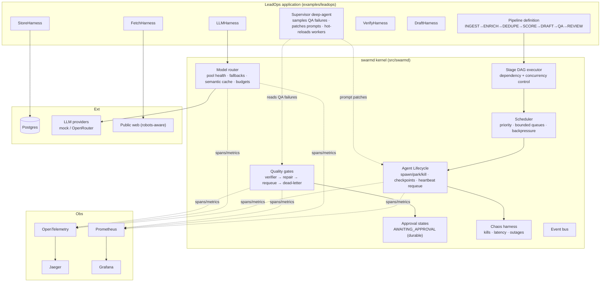

# ARCHITECTURE — swarmd System Design

**Status:** v2.0 · **Last updated:** 2026-08-24

## High-level view

## Key design decisions

| Decision | Choice | Over | Why |
|---|---|---|---|
| Scale stance | 10–50 purposeful agents | 1000+ trivial agents | orchestration quality (recovery, gates, HITL) is the demonstrable skill; headcount isn't |
| Concurrency model | asyncio stdlib core | threads/frameworks | I/O-bound agents; zero-dep auditable core; CPU work delegated by embedders |
| Work assignment | stage pools + atomic claim | central dispatcher push | kill/reassign becomes trivial; no dispatcher SPOF |
| Recovery unit | step-boundary checkpoints + heartbeat expiry | whole-task retries | completed work never redone; resumable determinism |
| Quality | verifier per stage, deny-downstream | post-hoc review | bad output is stopped at the gate; failure taxonomy measurable |
| HITL | durable pipeline state | in-memory callback | approvals survive restarts; auditable decisions |
| Outreach sends | never auto-send | optional auto mode | business safety; review queue is the product boundary |
| Model access | router w/ mock default | direct SDK calls | offline-first dev/CI; failover + cache measured honestly |

## Flagship flow: kill-and-resume mid-DRAFT

1. DRAFT pool has M outreach agents drafting concurrently; each lead's draft state
   checkpoints per step (researched → outlined → drafted → QA-passed)
2. Chaos kills an agent holding leads L1–L3
3. Heartbeat expires their claims → tasks requeue **with checkpoints**
4. Fresh agent claims L1–L3, skips completed steps, finishes drafts
5. Integrity checker: final DB contains exactly the expected lead set — hash matches clean run

## Failure modes considered

- Provider outage mid-stage → router health-scores degrade, fallback chain engages, chaos metrics record it
- Verifier bug blocks everything → dead-letter with full trace reference, run completes PARTIAL with report
- Process crash at AWAITING_APPROVAL → restart restores exact state from durable store
- Supervisor patches a bad prompt → patch history versioned; one-command rollback

## Scaling notes

Single process by design. Stage pools sized dynamically by Quartermaster-style logic if
added later. Interfaces (scheduler, store, provider) are the seams where multi-node could
enter — deliberately unbuilt.
