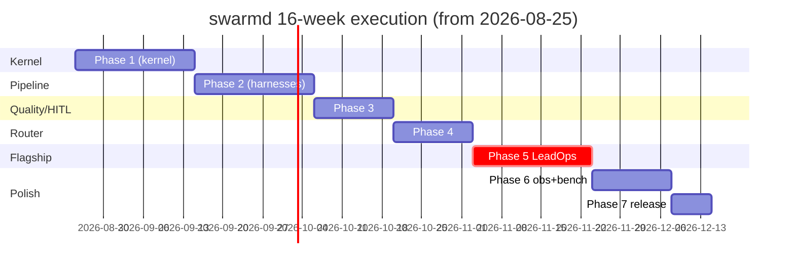

# PLAN — Execution Roadmap & Working Protocol

**Status:** v1.0 · **Created:** 2026-08-25 · Companion to [SPEC.md](SPEC.md) (phases/gates) and [PRD.md](PRD.md) (goals)

SPEC.md says *what* each phase delivers and *how it's gated*. This file says *in what
order we build it, what decisions each step will force, and what must be written down
when*. If SPEC and PLAN disagree, SPEC wins on scope; PLAN wins on order.

---

## 0. Working protocol (applies to every commit, every phase)

### 0.1 The three-write rule

A feature is NOT done until three things are written in the same commit:

| Write | Where | Content |
|---|---|---|
| Code + tests | `src/swarmd/`, `tests/` | Green tests, ruff+mypy clean |
| Progress log | `docs/flow.md` | What was done → **why** → **alternatives considered** → why they were rejected |
| Interview answers | `docs/interview_prep.md` | Every question this feature invites an interviewer to ask, answered confidently |

Gate evidence (command output, hashes, metrics) gets pasted under the matching
`## Gate evidence` heading in `flow.md`.

### 0.2 Decision blocks

Anything non-obvious gets a **decision block** in `flow.md`:

```
DECISION: <one-line choice>
ALTERNATIVES: <option B> · <option C>
WHY THIS: <the reason that survives follow-up questions>
TRADE-OFF ACCEPTED: <what we gave up, consciously>
```

If a decision is architectural (hard to reverse), it graduates to a numbered ADR in
`docs/adr/`. Rule of thumb: reversible → decision block in flow.md; one-way door → ADR.

### 0.3 Command anatomy (the "tweak notes" rule)

Every time we introduce a command, flag, config knob, or tunable constant, its first
appearance in `flow.md` includes an **anatomy block**: for each parameter —

```
ANATOMY: uv run swarmd demo kernel --kill-rate 0.3 --concurrency 8
  --kill-rate 0.3   probability any running agent is killed per scheduling tick.
                    Why 0.3: high enough to hit every recovery path in a 30s demo,
                    low enough that some agents survive to prove partial progress
                    is preserved. At 1.0 nothing completes; at 0.05 chaos is noise.
  --concurrency 8   max agents running simultaneously. Why 8: saturates the mock
                    provider's simulated latency without queue starvation; matches
                    the 10–50 agent stance from ADR-001 at demo scale.
```

Standard for these explanations: **understanding-level, not reference-level**. Say what
the knob *does*, why *this* value, and what *changing it* causes — the way one explains
LLM `temperature`: not "float, default 1.0" but "controls randomness of sampling; low =
deterministic/repetitive (good for extraction), high = creative/diverse (good for
brainstorming); we use 0.2 because verifiers need reproducible output." That depth, for
every knob we touch.

### 0.4 Branching & cadence

- One branch per step (e.g., `phase1/scheduler`), merged when its checklist below is green.
- `flow.md` updated in the merge commit — SPEC cross-cutting rule #4 (docs drift = bug).
- End of each week: re-read `interview_prep.md` top-to-bottom; anything unanswerable
  becomes next week's first task.

---

## 1. Phase 1 — Kernel & agent lifecycle (weeks 1–3)

Goal: a pure asyncio kernel where agents do real work, die chaotically, and the system
still produces byte-identical output to a clean run.

Build order (each step = one PR-sized unit):

| # | Step | Files | Key decisions this step forces | Tests |
|---|---|---|---|---|
| 1.1 | Toolchain bring-up | `uv.lock`, CI workflow, ruff/mypy verified | uv vs pip/poetry (record why); CI runner choice | lint+type pass in CI |
| 1.2 | Event bus | `events.py` | asyncio.Queue fan-out vs callbacks vs weakref listeners; sync emit vs async | ordering, no-loss under subscriber slowness |
| 1.3 | Task & Checkpoint models | `task.py` | dataclass vs pydantic vs msgspec (kernel purity, serialization for durable checkpoints); checkpoint payload schema versioning from day 1 | round-trip serialize/deserialize |
| 1.4 | AgentHandle lifecycle | `agent.py` | explicit state machine vs ad-hoc flags; which transitions are legal; KILLED vs FAILED semantics | illegal-transition rejection |
| 1.5 | Scheduler | `scheduler.py` | heapq priority vs FIFO+priority lanes; bounded queues & backpressure policy (block vs drop vs spill); fairness across stages | ordering, backpressure, starvation-freedom |
| 1.6 | Runtime: heartbeat & requeue | `runtime.py` | lease duration math (heartbeat interval vs expiry); atomic claim via DB row vs in-process registry; idempotency of resumed steps | kill-mid-step → resume skips completed steps deterministically |
| 1.7 | Chaos hook v1 | `chaos.py` | probabilistic kill vs scripted fault schedules; deterministic seeding (chaos must be reproducible in tests) | seeded chaos → identical output hash |
| 1.8 | Demo CLI wiring | `cli.py` | argparse vs typer/click (stdlib bias); output-hash printing | `swarmd demo kernel --kill-rate 0.3` hash == clean run |

**Gate:** `uv run pytest tests/kernel -q` green + demo hash equality (SPEC Phase 1).
**Docs due:** anatomy blocks for every flag above; interview answers for checkpoint
contract, heartbeat/double-processing, state machine.

---

## 2. Phase 2 — Pipeline & harnesses (weeks 4–6)

Goal: stages as DAG nodes with pools, verifiers wired between stages, five harnesses.

| # | Step | Files | Key decisions | Tests |
|---|---|---|---|---|
| 2.1 | Stage & DAG executor | `pipeline/stage.py`, `pipeline/dag.py` | topological execution vs event-driven readiness; per-stage pool sizing API; cycle detection | DAG ordering, independent stages concurrent |
| 2.2 | Harness base contract | `harnesses/base.py` | Harness = toolset+prompt+loop-policy composition vs inheritance; sync tool calls vs async | contract conformance |
| 2.3 | LLMHarness + mock provider | `harnesses/llm.py`, `router/providers.py` (skeleton) | provider interface shape (chat vs completions vs responses); deterministic mock design (seeded, transcript-recorded); temperature/top_p exposure at harness level → **anatomy block: temperature, top_p, max_tokens** | determinism across runs |
| 2.4 | FetchHarness | `harnesses/fetch.py` | httpx vs aiohttp; robots.txt caching; token-bucket rate limiting (anatomy: rate, burst) | allowlist enforcement, rate-limit behavior |
| 2.5 | StoreHarness | `harnesses/store.py` | asyncpg pool sizing; upsert conflict keys; schema migrations approach | persistence round-trip |
| 2.6 | VerifyHarness + gates | `harnesses/verify.py`, `pipeline/gates.py` | verifier protocol (sync predicate vs async check object); repair-loop bounds (why bounded: infinite repair = livelock); dead-letter semantics | failures never leak downstream |

**Gate:** two-stage demo with injected failures; report shows pass rates (SPEC Phase 2).
**Docs due:** harness-vs-agent-vs-stage explainer; anatomy for retry/backoff knobs
(retries, backoff base, jitter — with the "why exponential + jitter" story).

---

## 3. Phase 3 — Quality gates & HITL durability (weeks 7–8)

| # | Step | Files | Key decisions | Tests |
|---|---|---|---|---|
| 3.1 | Verifier protocol formalized | `pipeline/gates.py` | composable checks (AND-chains) vs monolithic verifier; failure taxonomy enum design | taxonomy classification |
| 3.2 | Durable approval state | `hitl/approvals.py` | AWAITING_APPROVAL persisted where (same Postgres, dedicated table); restart replay logic | kill process at review → restart → state intact |
| 3.3 | HITL CLI | `cli.py` | approve/reject/edit UX; audit trail append-only design | `swarmd approve|reject|list` audited end-to-end |
| 3.4 | Run quality report | `pipeline/gates.py` | report format (JSON artifact vs stdout); failure taxonomy rollup | report contents match injected failures |

**Gate:** full restart-at-review-queue scenario (SPEC Phase 3).
**Docs due:** "what if the verifier is wrong?" answer; audit-trail immutability rationale.

---

## 4. Phase 4 — Model routing & cost control (weeks 9–10)

| # | Step | Files | Key decisions | Tests |
|---|---|---|---|---|
| 4.1 | Provider health scoring | `router/health.py` | EWMA latency scoring vs simple error-rate; failover trigger thresholds (<2s target) | forced outage → transparent fallback |
| 4.2 | Semantic cache | `router/cache.py` | embedding similarity threshold choice (anatomy: threshold, TTL, LRU size — with the precision/recall trade-off spelled out); cache key normalization | ≥60% hit rate on repeated workload |
| 4.3 | Token budgets | `router/providers.py` | per-run vs per-stage budgets; breach behavior (clean abort + report, not silent truncation) | budget breach aborts cleanly |
| 4.4 | OpenRouter adapter | `router/providers.py` | free-tier model selection; same-interface conformance; network-isolated tests via recorded transcripts | adapter behind interface flag |

**Gate:** router test suite + cache/failover demos (SPEC Phase 4).
**Docs due:** cache-threshold anatomy; health-scoring formula walkthrough.

---

## 5. Phase 5 — LeadOps flagship (weeks 11–13) ⭐

| # | Step | Files | Key decisions | Tests |
|---|---|---|---|---|
| 5.1 | Fixtures & sources | `examples/leadops/sources/` | fixture realism (messy enough to exercise dedupe/enrich); licensing of open data | fixtures load offline |
| 5.2 | INGEST→ENRICH→DEDUPE | `examples/leadops/agents/` | embedding candidates + LLM confirm dedupe (vs pure fuzzy-match); blocking vs clustering | dedupe precision on known duplicates |
| 5.3 | SCORE + DRAFT pools | same | rubric-as-structured-output; per-domain rate limits for drafts; persona/template config | parallel draft speedup measurable |
| 5.4 | QA stage | same | hallucination spot-check strategy; tone/compliance checks | QA catches seeded bad drafts |
| 5.5 | Supervisor deep-agent | `examples/leadops/agents/supervisor.py` | patch proposal format; versioned application; hot-reload mechanics (ADR-005) | patch improves QA pass-rate delta; rollback works |
| 5.6 | Chaos everywhere + integrity checker | `examples/leadops/integrity.py` | integrity hash definition (order-independent canonical form) | chaos run hash == clean run hash |

**Gate:** `uv run leadops run examples/leadops/pipeline.py --chaos --kill-rate 0.2`
completes with matching integrity hash, QA report, supervisor log (SPEC Phase 5).

---

## 6. Phase 6 — Observability & benchmarks (weeks 14–15)

| # | Step | Files | Key decisions |
|---|---|---|---|
| 6.1 | OTel tracing | `observability/tracing.py` | span hierarchy (run→stage→agent→step→LLM call); attribute schema; sampling strategy |
| 6.2 | Prometheus metrics | `observability/metrics.py` | metric naming/cardinality policy (labels: stage, agent_pool — never lead_id) |
| 6.3 | Grafana dashboards | `observability/grafana/` | panel selection per PRD G-goals; committed as JSON provisioning |
| 6.4 | Bench suite | `swarmd bench` | benchmark workloads; BENCHMARKS.md format; statistical rigor (repeats, medians) |

**Gate:** Jaeger trace chain end-to-end during chaotic run; dashboards live;
≥4× draft-stage speedup documented (SPEC Phase 6).

---

## 7. Phase 7 — Packaging & release (week 16)

PyPI publish, clean-machine quickstart verification, README diagram + benchmark table,
demo video, tag v0.1. Checklist = PRD §9 acceptance criteria, item by item.

---

## 8. Milestone summary



## 9. Standing risk watchlist (reviewed at each phase boundary)

| Risk | Watch signal | Pre-agreed response |
|---|---|---|
| Checkpoint/resume nondeterminism | hash mismatch in Phase 1 gate | freeze mock provider seed; bisect step boundaries before proceeding |
| Scope creep in flagship | LeadOps features beyond PRD §7 | cut to PRD; new ideas go to backlog, not the pipeline |
| Chaos tests flaky in CI | red CI without code change | seeded chaos only; no wall-clock assertions |
| Doc debt | flow.md older than latest feature commit | merge blocked until caught up (rule 0.1) |
